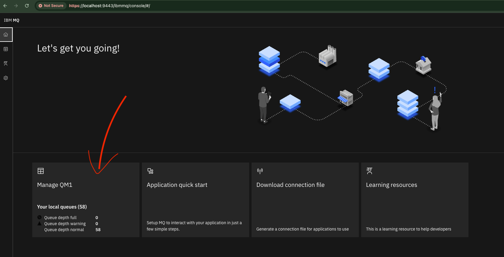
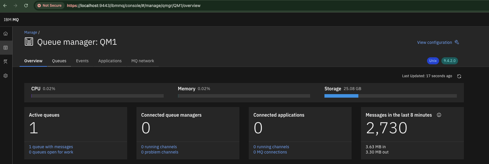
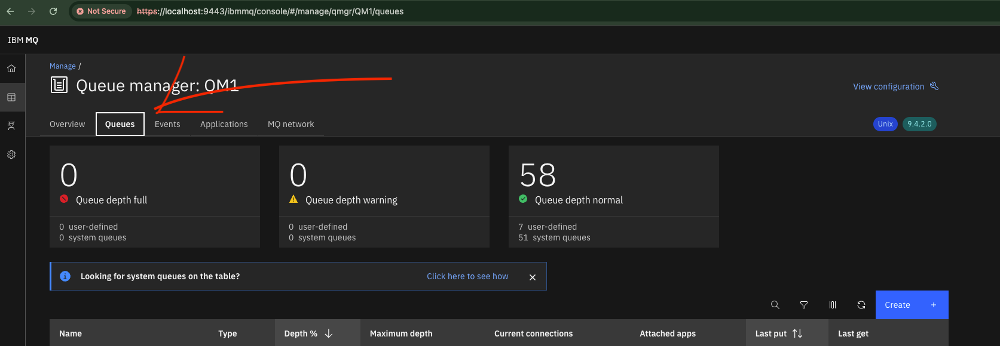
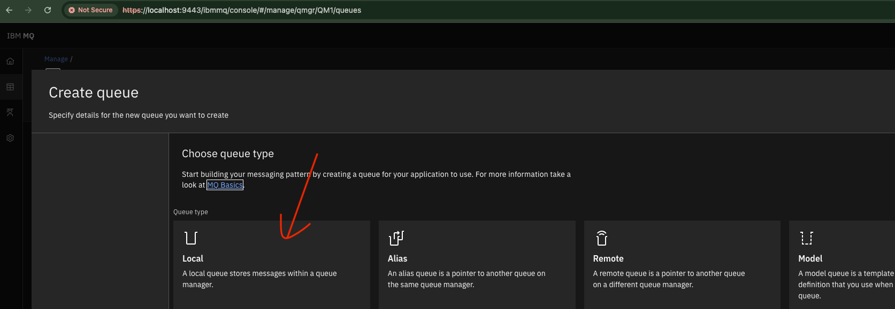
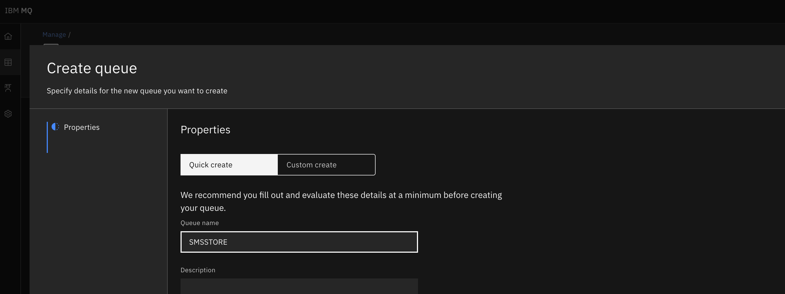

# WSO2 Micro Integrator as a Publisher and Subscriber with IBM MQ.
This guide provides step-by-step instructions to configure JMS transport sender and receiver 
in WSO2 Micro Integrator (MI). It focuses on setting up the MI to send and receive messages via JMS, 
excluding IBM MQ specific configurations.

### Prerequisites.
1. WSO2 Micro Integrator installed and set up.
2. Necessary JMS client libraries placed in the <MI_HOME>/lib directory 
   
   ```
   MQ libraries can be found in the <IBM_MQ_HOME>/java/lib/ directory if docker location is /opt/mqm/java/lib/
   ```
   * `com.ibm.mq.allclient.jar`
   * `fscontext.jar`
   * `jms.jar`
   * `providerutil.jar`

   
3. The IBM MQ broker accessible to the MI. 

   `For local testing, you can use the IBM MQ Docker image.`
   ```bash
    docker run -d --name ibm-mq -e LICENSE=accept -e MQ_QMGR_NAME=QM1 -p 1414:1414 -p 9443:9443 ibmcom/mq
    ```
   `If you are using macOS, There is no arm64 images in docker hub, you can build own docker image with below commands`
   ```bash
    git clone https://github.com/ibm-messaging/mq-container.git
    cd mq-container
    # git checkout 9.4.2.0-r2
    make build-devserver
    make build-devserver COMMAND=docker
    docker run -e LICENSE=accept -e MQ_QMGR_NAME=QM1 -e MQ_ADMIN_PASSWORD=passw0rd -p 1414:1414 -p 9443:9443 ibm-mqadvanced-server-dev:9.4.2.0-arm64
    ```
   Create a destination queue in the IBM MQ broker.
   <div style="display: flex; flex-wrap: wrap; gap: 10px; justify-content: flex-start;">
     
     
     
     
     
   </div>
   
## 1. Configure .bindigs file.
You need to create a `.bindings` file that contains the connection factory and destination information for your JMS broker.
You can use the IBM Explorer to create this file, 

Or you can manually create it using 
the [mq-bindings-generator](https://github.com/JanakaPushpakumara/mq-bindings-generator) tool with your own connection factory and destination information.
Place the generated `.bindings` file in the `<MI_HOME>/conf/jndidirectory` directory.

Ex:
```
mvn clean compile exec:java \
-Dexec.mainClass="com.example.mq.MQBindingsGenerator" \
-Djndi.provider.url=file:/Users/janakap/WSO2/SynapseIntegrations/wso2mi-4.2.0/conf/jndidirectory
```
## 2. Enable JMS Transport in deployment.toml
Update the deployment.toml file located in the <MI_HOME>/conf directory to enable JMS transport sender and listener.

####  JMS Listener Configuration.
```
[[transport.jms.sender]]
name = "myQueueConnectionFactory"
parameter.initial_naming_factory = "com.sun.jndi.fscontext.RefFSContextFactory"
parameter.provider_url = "file:///Users/janakap/WSO2/SynapseIntegrations/wso2mi-4.2.0/conf/jndidirectory"
parameter.connection_factory_name = "myQueueConnectionFactory"
parameter.connection_factory_type = "queue"
parameter.username = "admin"
parameter.password = "passw0rd"
```
#### JMS Sender Configuration.
```
[[transport.jms.listener]]
name = "myQueueConnectionFactory"
parameter.initial_naming_factory = "com.sun.jndi.fscontext.RefFSContextFactory"
parameter.provider_url = "file:///Users/janakap/WSO2/SynapseIntegrations/wso2mi-4.2.0/conf/jndidirectory"
parameter.connection_factory_name = "myQueueConnectionFactory"
parameter.connection_factory_type = "queue"
parameter.username = "admin"
parameter.password = "passw0rd"

```
Ensure that the provider_url match your `.bindings` file location and the connection_factory_name
matches the one defined in your bindings file.

## 3. Create Proxy Services.

You can find the sample proxy services in the IBM MQ directory of this repository.

* JMS Consumer Proxy : `JmsConsumerProxy.xml`
* JMS Producer Proxy : `JmsProducerProxy.xml`

## 4. Deploy Proxy Services in WSO2 MI and Start the WSO2 Micro Integrator server.

## 5. Testing the Setup.

Send a test message to the JMSProducerProxy via HTTP. Verify that the message is received 
and processed by the JMSConsumerProxy. Check the server logs to confirm message flow and processing.
stackoverflow.com

Ex: Curl command to send a message to the JMSProducerProxy:
```bash
curl -X POST http://localhost:8290/services/JMSPublisherProxy \
-H 'content-type: application/xml' -d '<a>hello world</a>' 
```

## Additional Notes.
Ensure that the JMS client libraries corresponding to your JMS broker are present in the <MI_HOME>/lib directory.
